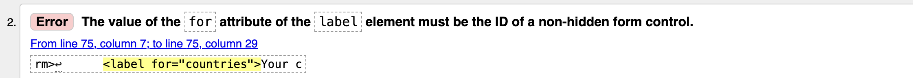

### LONI - Single Parents All-in-One Platform

LONI is a website for an early stage pre seed Startup. It is a brief introduction into what is going to become a one-stop social network directed at addressing the life of single parents that come in all colours, shapes and social roles. The website provides few resources, insights and direct access to a waitlist.

### Table of Contents

1. [Scope](#scope) 
2. [Product Design](#product-design)
3. [Features](#features)
4. [Technologies](#technologies)
5. [Testing and Deployment](#testing-and-deployment) 
7. [Credits](#credits)

### Scope
The scope of this project (PP1) was to deliver MVP of a website coded exclusively with HTML and CSS. I decided to do a basic structure that was viable according to my capabilities and 3 weeks knowledge. Due to the prolonged sickness that affected partially skipped lessons, my main methodology was learning by doing. 

### Product Design

As i already know my potential Users /  Comrades I jumped straight into User stories. Here are some example:
- As a visitor, I want to quickly understand the purpose of the website so that I can decide whether or not to join the waitlist.
- As a visitor, I want the homepage to be trustfull  so that I feel confident providing my email to join the waitlist.
- As a single parent in need of help, I want easy access to a list of emergency contact numbers so that I can get immediate support during a crisis.
- As a single parent, I want to read real-life stories from other single parents so that I feel inspired and understood.
- As a visitor, I want a simple form to enter my email for the waitlist so that I can stay informed about the platform’s launch and updates.
- As a visitor, I want a confirmation message after submitting my email so that I know I successfully joined the waitlist.

When it comes to UI Design I again aimed for basics according to scope and time limitation. Colours are gender and social status neural aiming for diversity and accessibility. As my coding capabilities grow, so will design follow.

### Features

HERO VIDEO - The greatest hamartia of this website is the Hero video where I intentionally went against autoplay and choose to prioritise empathy over rule. The beautiful kid in movement provides a warm welcoming and accompanies the hero message. I actually did a user test with two people (yes it is a small number) and they said they preferred autoplay.
 
LOGO - For the logo I did not have time for a graphic interpretation, but instead I went for a Font  distinction that I incorporated across websites. This Font style gives a playful childish look to the generally cooled website because single is parent  to a child - and not only semantically.

NAVIGATION BAR - placed horizontally, in the same line like logo exhibits minimalistic style and simplicity. As responsive design needs adjustment, horizontal bar becomes a hamburger menu with dropdown. There are many versions how to create this one but I used *span* to create lines.

FOOTER - is not my proudest work but it has all the necessary information. One of the biggest challenges I had was keeping footers at the end of the page independently from the heat of the content. I still do not quite understand it but I hope it will come soon.

GET HELP -  Page serves as an emergency  solution, a quick fix for parents to contact and seek help in the most urgent cases. This is a short and useful way to substitute the help that LONI will provide as a platform once developed. In this section there is still work to be done, especially on the functionality of a dropdown menu. The plan is not only to adapt it stylistically but also to provide a change of content according to the country of residence. In the case shown here it is only free emergency resources from Germany.

BLOG - this page serves as a focal point for information about experiences and situations single parents go through. It is created with responsive card layout design built with HTML and CSS. Each card contains an image, short intro text explaining the subject of the article and a "Read More" button linking information to sources.

ABOUT - page is designed to invite users to join the waitlist and stay informed about the progress of the LONI digital platform. The email input field is a central component of the waitlist form, designed with usability and responsiveness in mind.The placeholder text ("your email") provides immediate clarity on what is expected, reducing potential confusion for users.I had to make some design adjustments because the footer was unexpectedly moving up, and although I experimented with flexbox to address the layout issues, the solution isn't entirely satisfactory yet. Additionally, I've included two extra pages: one serves as a thank-you note for signing up, and the other is a link to a survey single parents could fill after submitting their contact.

### Technologies
1. HTML5 - for structure and content for the website.
Process - as the time passed process for HTML was becoming more easy, I tried to incorporate semantic elements and I am looking forward to mastering this part.
2. CSS3 - for3 layout, styling, and responsive design.
Process - design is cool in figma but in code it can be a loooooong walk if you do not know all possibilities. And it was a lot of walking and typing but finally it became interesting.
3. Flexbox and Grid - for adaptable layout. Process - this is my first nightmare. One who masters the flexbox masters universe. I was again trying out a lot and returning to lectures but it just takes time and I will investigate it.
4. Media Queries - for responsiveness across devices. This is my second nightmare. I didn't do it quite well so I had to use a lot of important commands. I think the order was wrong so min and max values. I need toI get back to it.

### Testing and Deployment

I think my whole process was all about testing, trial and error. I was all the time testing while coding using Dev tools and adjusting according to inspection. I used W3C HTML Validator to fix and adjust my HTML code and W3C CSS Validator for CSS. I tested links in the browser and as I deployed. Some functionalities in media queries I still need to master in order to have better performance. 

Bugs - There were several bugs in my HTML code that I resolved using W3C Validator. Many of them were Trailing slashes caused by using Prettier code formatter and some were functional made by lack of focus. You can find one example in the picture. 

DEPLOYMENT - The site was deployed using GitHub pages and newly activated VS Code. Before deployment I had to clone and move my project from Gitpod to VS code.

### Credits

Video clip and photos are from [Envato](https://elements.envato.com/) and have full licence. 

Inspirational links for parts of code could be found here: [Security](https://stackoverflow.com/questions/50709625/link-with-target-blank-and-rel-noopener-noreferrer-still-vulnerable), [Hamburger](https://medium.com/@mateus2050/hamburguer-menu-html-and-css-only-c06364fa9bfd), [Cards](https://www.w3schools.com/howto/howto_css_cards.asp) and general student inspiration from [Kristyna](https://github.com/Cushione/dapper-hill-dog-boutique/tree/main)

Thanks to my family and friends for stepping in and helping me with child care when I needed it most.

